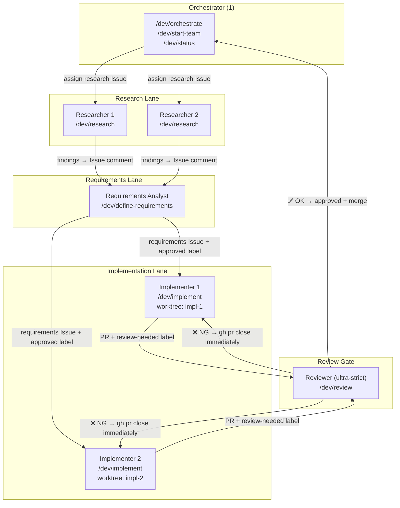
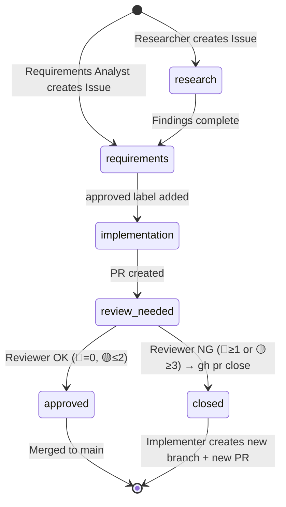

# Architecture

This document describes the multi-agent development architecture used in **ai-assistant**.

## Overview

The system runs as a **team of specialized Claude Code / Codex agents** coordinated by a single Orchestrator.
All work is tracked through GitHub Issues and Pull Requests.
Parallel implementation uses `git worktree` so agents work on isolated branches without interfering.

## Agent Flow



## State Machine: Issue Labels



## Key Decisions

### Why git worktree?

Running multiple agents on the same checkout causes frequent `git checkout` conflicts.
`git worktree` gives each Implementer a fully isolated working directory on a dedicated branch.
The Orchestrator stays on `main` and pulls the latest after each merge.

### Why immediate close on NG?

Fix-loops create low-quality PRs that slowly accumulate technical debt.
Closing immediately and requiring a fresh branch forces a clean slate and promotes higher quality from the start.

### Why GitHub Issues as source of truth?

Issues are persistent, queryable, and accessible to all agents regardless of their working directory.
They also serve as the handoff record between roles — a Requirements Analyst's `approved` Issue is the input contract for an Implementer.

## Directory Layout

```text
.claude/
├── commands/
│   ├── dev/          # Core workflow commands (Markdown prompts)
│   └── pmo/          # Optional PMO profile commands
├── worktrees/        # git worktree checkout directories
│   ├── impl-1/       # Implementer 1
│   └── impl-2/       # Implementer 2
└── team-topology.yaml  # Role definitions, lanes, worktrees, handoffs

scripts/
├── setup-worktree.sh   # Create and initialize a new worktree
├── worktree-cleanup.sh # Remove worktree and delete branch
├── list-worktrees.sh   # List active worktrees
├── setup-labels.sh     # Create 6 workflow labels in any repo
├── bootstrap.sh        # Non-destructive env setup
├── doctor.py           # Environment health check
└── validate-config.py  # Config integrity check
```

## Related Documents

- [docs/customization.md](customization.md) — How to adapt the template to your team
- [docs/pr-review-flow.md](pr-review-flow.md) — Detailed PR review process
- [docs/onboarding.md](onboarding.md) — First-time setup guide
- [docs/faq.md](faq.md) — Frequently asked questions
